*********************
Command Line Commands
*********************
Here we have a directory called "miri_example" that has some MIRI cals.
JHAT can also be run from the command line in the following way:

.. code-block:: python

	run_st_wcs_align.py miri_example/jw02666001001_02101_00001_mirimage_cal.fits --outrootdir '.' 
		--outsubdir aligned  --overwr -v --refcat gaia --saveplots -tt -pp --histocut_order dxdy

Which produces the following plots:

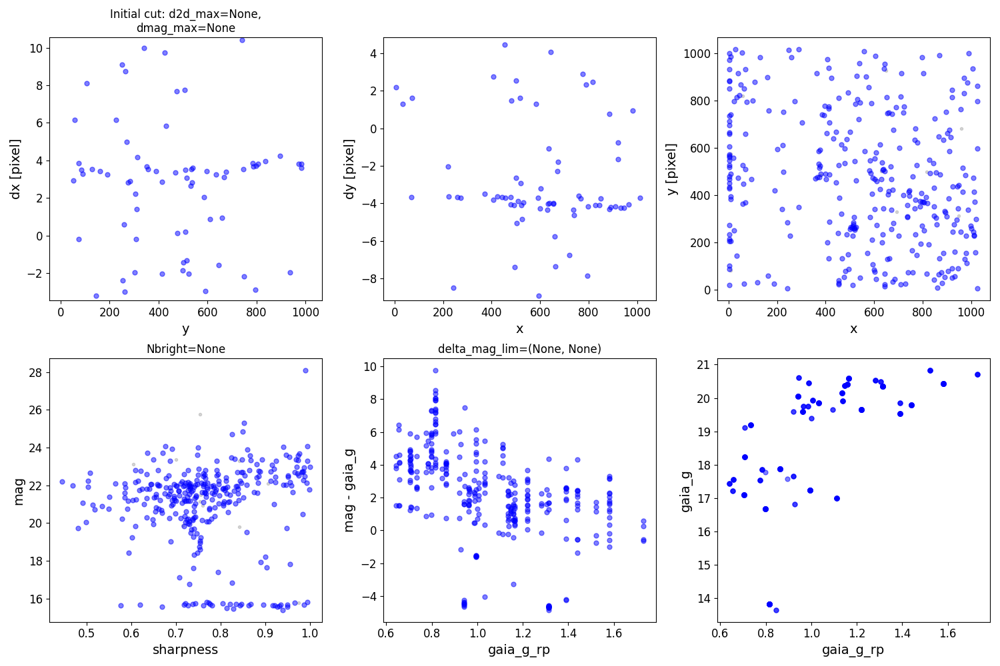

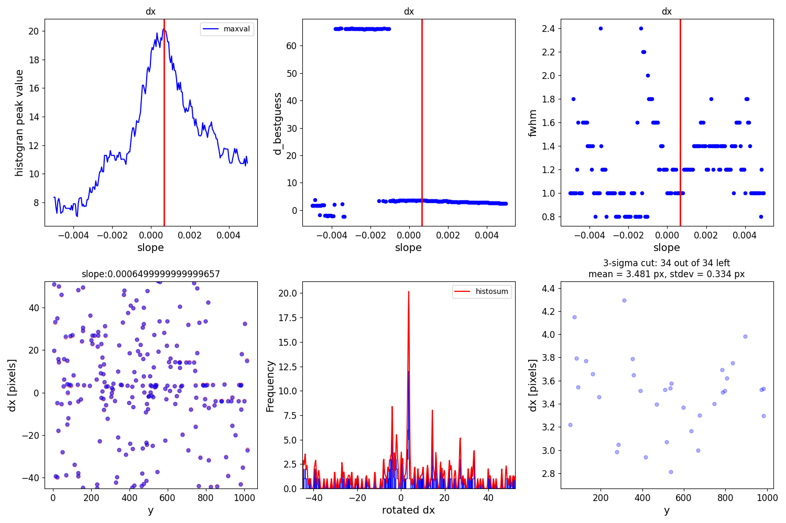

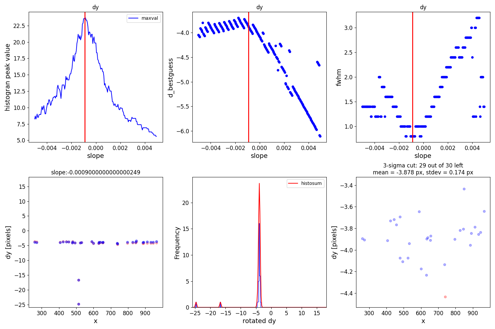

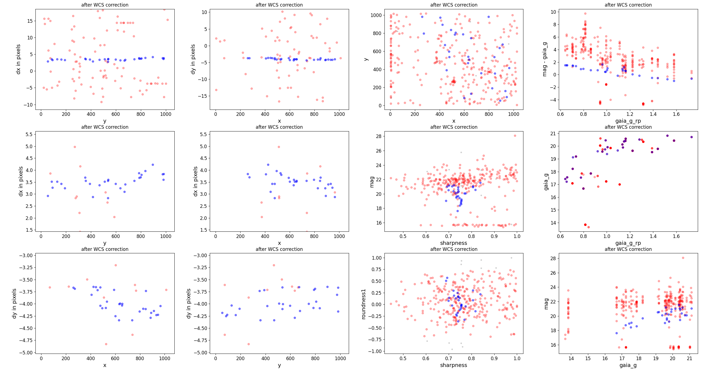

###################
Improving Alignment
###################
Sometimes, in particular if there are not enough sources or the images are
particularly poorly aligned, JHAT has a difficult time finding a good
alignment (or it can be improved). Here are a few methods for improving the
results. First we add cuts on sharpness, roundness, and brightness:

.. code-block:: python

	run_st_wcs_align.py miri_example/jw02666001001_02101_00001_mirimage_cal.fits --outrootdir '.' 
		--outsubdir aligned  --overwr -v --refcat gaia --saveplots -tt -pp --histocut_order dxdy 
		--roundness1_lim -0.5 0.5 --objmag_lim 14 21.5 --sharpness_lim 0.6 0.85 --refmag_lim 16 25

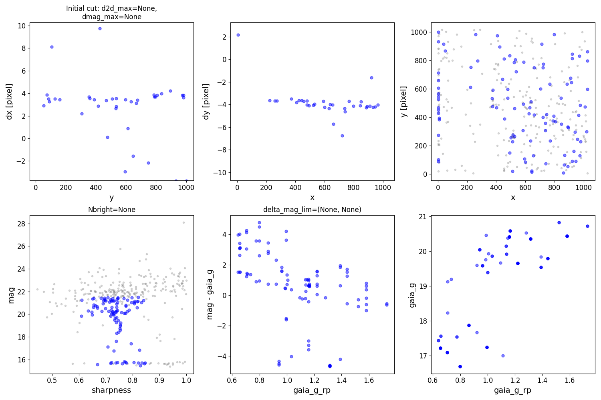

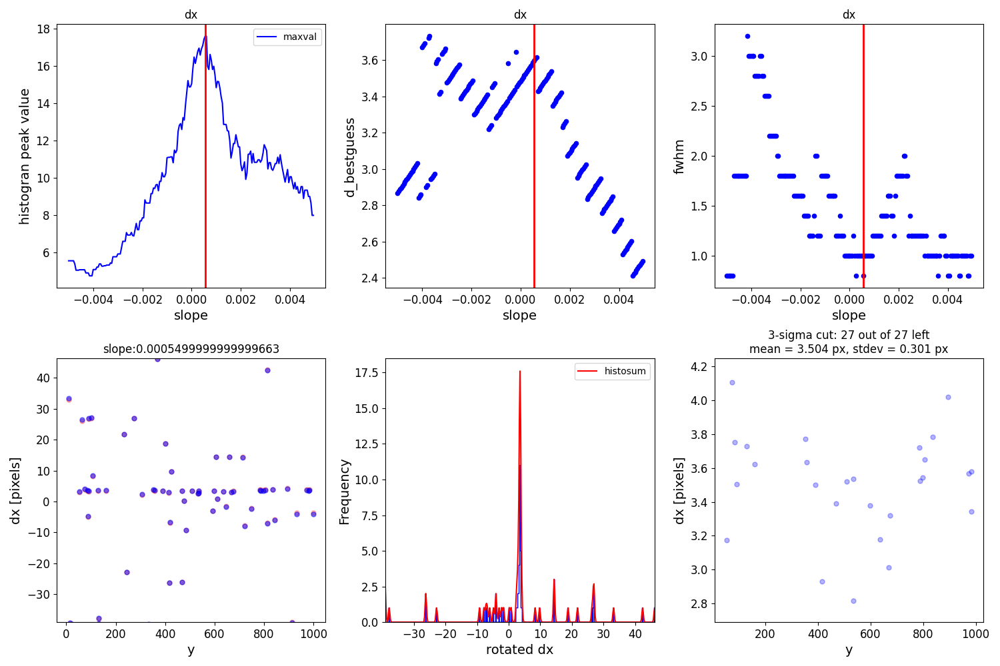

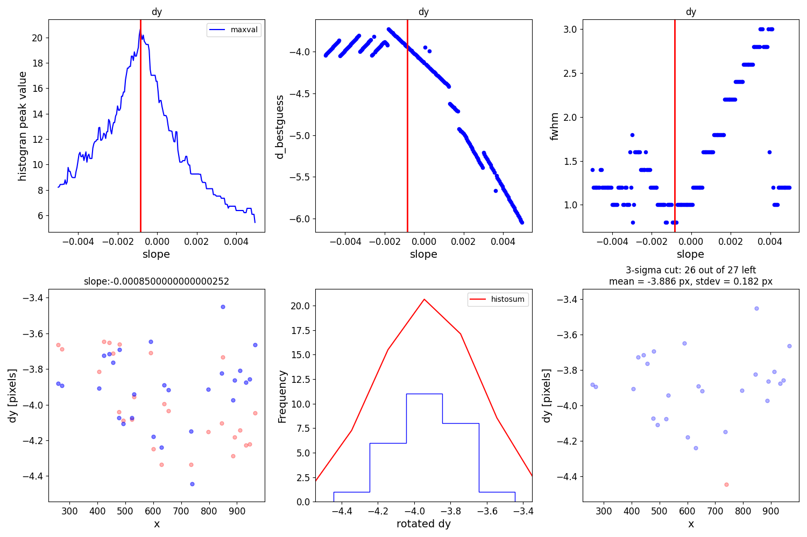

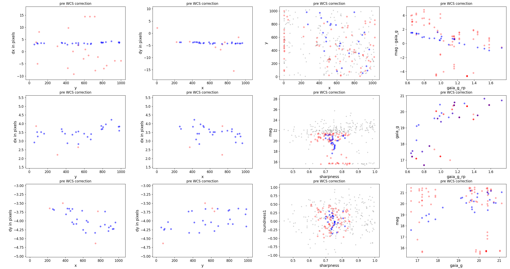

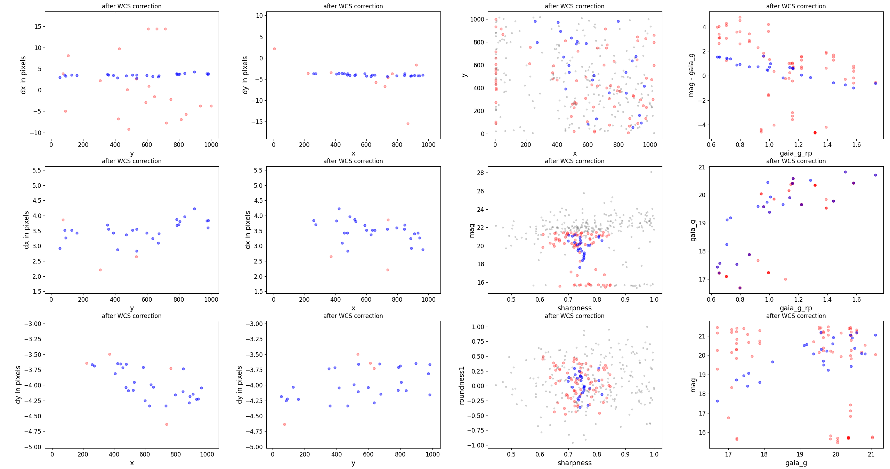

Next we increase the allowed distance between matches between the reference and target catalogs (``d2d_max``),
and limit the difference between measured magnitudes between the catalogs. 

.. code-block:: python

	run_st_wcs_align.py miri_example/jw02666001001_02101_00001_mirimage_cal.fits --outrootdir '.' 
		--outsubdir aligned  --overwr -v --refcat gaia --saveplots -tt -pp --histocut_order dxdy 
		--roundness1_lim -0.5 0.5 --objmag_lim 14 21.5 --refmag_lim 16 25 --delta_mag_lim -2 2 --d2d_max 1.5

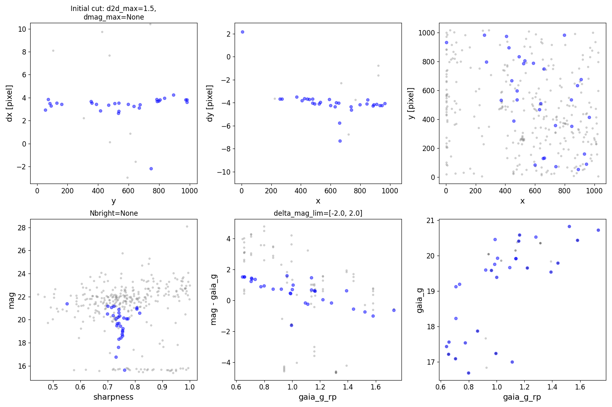

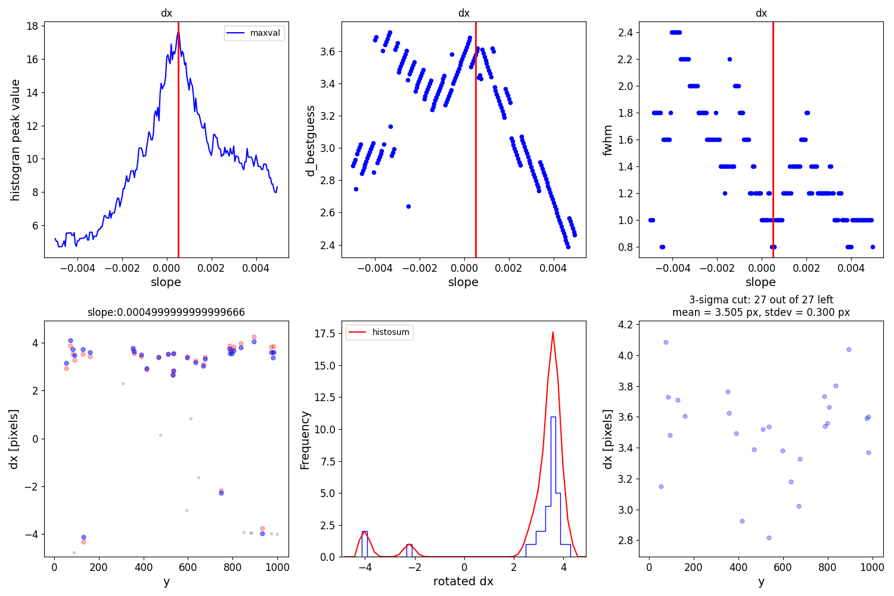

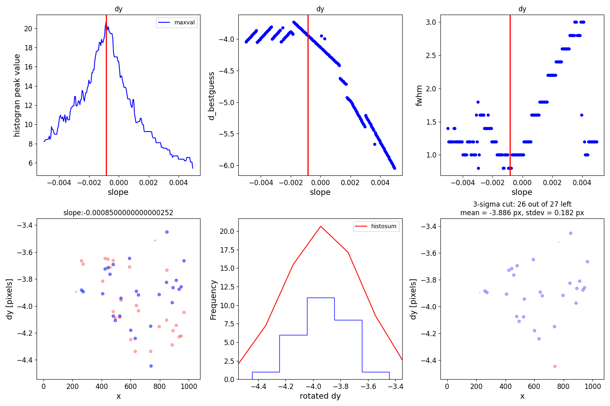

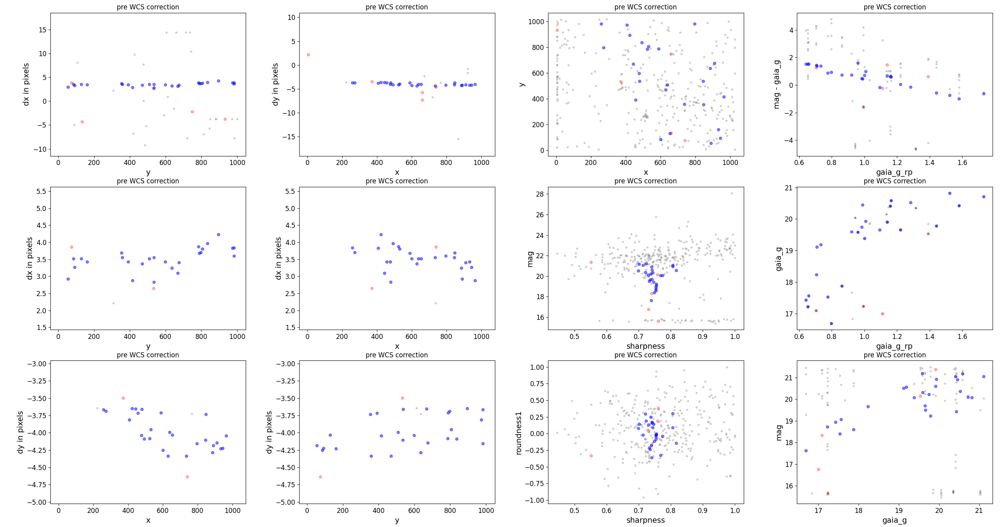

Finally, we might use the previous results to guess the rough needed offset, and apply it 
directly before the matching begins:

.. code-block:: python

	run_st_wcs_align.py miri_example/jw02666001001_02101_00001_mirimage_cal.fits --outrootdir '.' 
		--outsubdir aligned  --overwr -v --refcat gaia --saveplots -tt -pp --histocut_order dxdy 
		--roundness1_lim -0.5 0.5 --objmag_lim 14 21.5 --refmag_lim 16 25 --delta_mag_lim -2 2 
		--d2d_max 1.5 --xshift 3 --yshift -4

.. image:: _static/Figure_42.png
    :width: 1000px
    :align: center
    :height: 600px
    :alt: alternate text

.. image:: _static/Figure_43.png
    :width: 1000px
    :align: center
    :height: 600px
    :alt: alternate text

.. image:: _static/Figure_44.png
    :width: 1000px
    :align: center
    :height: 600px
    :alt: alternate text

