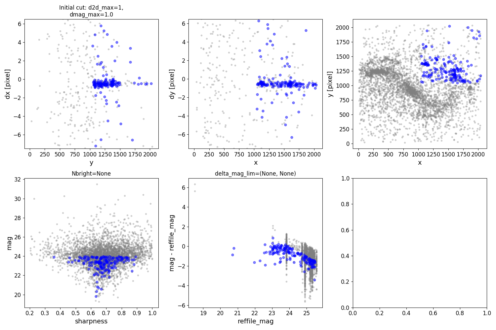
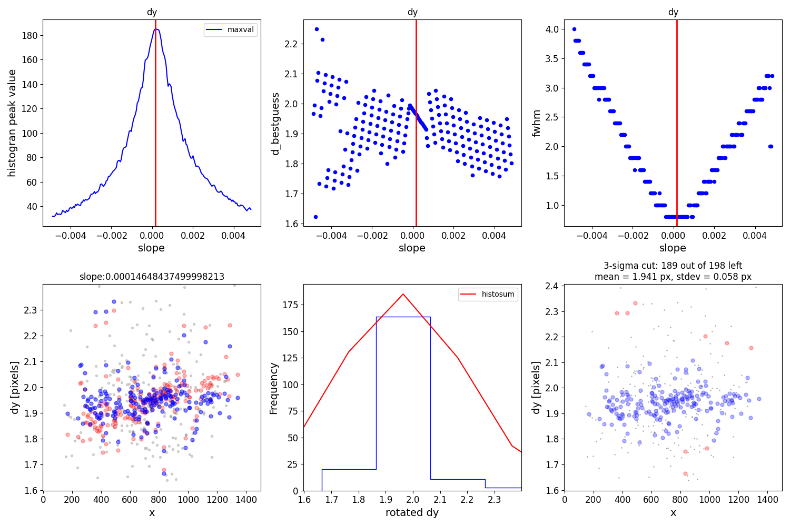

******************
Interpreting Plots
******************
This is the initial plot to check if things are going the right direction. Here each point is a source detected in the image. Blue points have passed the initial cuts, gray points fail cuts are are not used. If there is a locus in both dx and dy, then the code will be able to find the correct alignment parameters. The second row just shows the same sources as a function of some photometric parameters. 

This is an example of the same set of plots for a case where the alignment has failed. No locus is apparent in dx or dy. If there is no relation to be seen in this initial plot, then cuts and params need to be changed/loosened (see :ref:`params:Useful Parameters`.)

.. image:: _static/failed_cut.png
    :width: 1000px
    :align: center
    :height: 800px
    :alt: alternate text

The second important set of plots comes from the selection of good matches between reference catalog and target image source catalog. First the best rotation and offset is chosen for dx, which is successful if there is a clear peak in the upper left panel (histogram peak value versus slope). In the second row, blue dots are sources that are kept after rotation, and red are the original unrotated dx residuals (lower left panel). Then a 3sigma cut is done on the sources in the dx parameter space, and red indicates the cut values in the far right center row. Finally, the the same is done for dy, but ONLY with sources that already passed the dx cut.

.. image:: _static/cut_plot2.png
    :width: 1000px
    :align: center
    :height: 800px
    :alt: alternate text
